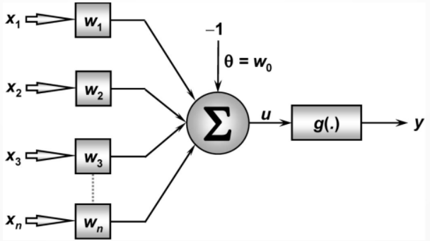
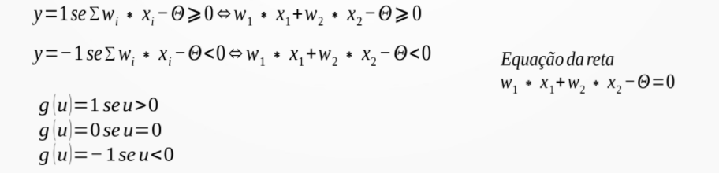
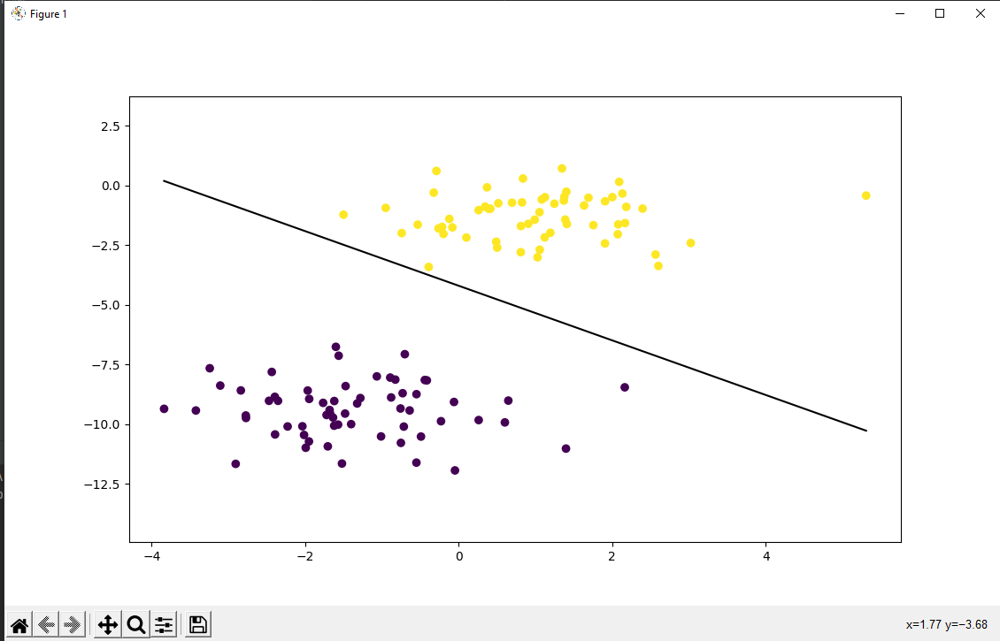

# PerceptronTopicos1
 projeto de perceptron para cadeira de topicos 1

#### Alunos: Leonardo Barboza Borges e Luciano Marques Brito Reis.

## Enunciado:
Pela análise de um processo de destilação fracionada de petróleo observou-se que determinado óleo
poderia ser classificado em duas classes de pureza {P1 e P2} a partir da medição de três grandezas 
{x1, x2 e x3}, que representam algumas de suas propriedades físico-químicas. A equipe de
engenheiros e cientistas pretende usar urna rede Perceptron para executar a classificação automática
das duas classes.
Assim, baseado nas informações coletadas do processo, formou-se o conjunto de treinamento
apresentado no apêndice I, tomando por convenção o valor -1 para óleo pertencente à classe P1 e o
valor 1 para óleo pertencente à classe P2. Para tanto, o neurônio constituinte do Perceptron terá
então três entradas e uma saída conforme ilustrado na figura abaixo. 

<br/>
**Figura 1: Estrutura básica de um Perceptron**

## oque foi proposto?
em suma oque foi proposto era que usando essa base de dados disponível nesse [dataset](content/Dataset.txt),
disponibilizado pelo professor. nosso trabalho e usar a logica do perceptron como foi mostrado o problema no
Enunciado acima.

### funcionamento:
o código possui tais elementos como variáveis na classe de Perceptron:
- entradas
- saídas
- taxa de aprendizagem
- épocas
- limiar <br/>

 sendo o processo começa com a leitura do arquivo aonde estra o dataset em arquivo csv
[datasetCSV](./content/dataset.csv) aonde as amostras são convertidas para float para
poderem ser usadas na  classe percptron aonde a logica do perceptron e aplicada
depois os dados são copiados para serem usados mais tarde.<br/><br/>
apos isso ele são jogados na classe perceptron aonde em aplicado toda logística dos
cálculos que são feitos. a imagem a seguir ilustra os cálculos que são feitos:<br/><br/>
<br/>
**Figura 2: equação usada para logica de Perceptron** 
<br/><br/>
### algumas exemplos formulas do Perceptron
```
u = wi∗xi−Θ
```
```
y = g(u)
```
### treinamento do perceptron
```
wi(atual) = wi(anterior) + N * (d ^ k -y)
```
```
Θi(atual) = Θi(anterior) + N * (d ^ k -y) * x^k
```

essa logica e aplicada como a função do perceptron trabalha seguindo essa logica de 
calculo, nisso ela faz o treinamento que e o ajuste de pesos para que posteriormente
na função de teste podemos diferenciar se um óleo pertencer a classe P1
ou se ele pertence a classe P2
### considerações finais
o processo final gerado poderia ser analisado de varias formas, taxa de acerto
e comparação ou gerando um grafico para poder separa as amostras de óleo que
são de P1 e as que são de P2, seria algo mais visual mas optamos por algo mais simples
que pdoeria ser falcimente entendio quando compilado.

<br/>**Figura 3: exemplo de grafico visual de Perceptron** 
Em suma foi um projeto bastante interessante para se analisar
ele mostra como importante estudar redes neurais, e como isso
é importante para assuntos como Ciência de dados.

